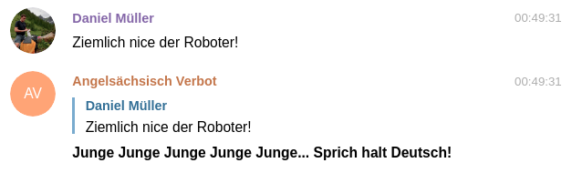

# Ein Nachrichtenraum-Roboter, der Angelsächsisch rügt 

Ein wundervoller Telegram Roboter, der euch in jeder Gruppenunterhaltung auf Telegram höflich daran erinnert kein Angelsächsisch zu nutzen. Nach dem Vorbild des besten Unter's dieser Erde: [r/ich_iel](https://www.reddit.com/r/ich_iel/)



## Wie füge ich den Roboter zu meiner Gruppenunterhaltung hinzu?

Der Gruppenunterhaltungs-Administrator muss den Roboter hinzufügen. Dabei geht man genauso vor, als würde man einen normalen Nutzer der Gruppe hinzufügen:

**Gruppen-Einstellungen -> Person hinzufügen -> Suche nach** `angelsaechsisch_telegram_bot`

Eventuell muss man noch explizit erlauben, dass der Roboter die Nachrichten lesen darf. Falls du dabei bedenken hast, bitte Kapitel [Datenschutz](#datenschutz) durchlesen.

## Befehle

**`/start` und `/hilfe`**

Mit diesen Befehlen wird eine Übersicht gezeigt. In dieser sind alle Befehle sowie die aktuellen Einstellungen gelistet.

**`/amtag X`**

Mit diesem Befehl kann eingestellt werden, wie oft euch der Roboter **pro Tag** daran erinnert kein Angelsächsisch zu nutzen. Um Mitternacht setzt sich der Zähler zurück. `X` muss dabei ganzzahlig und >= 0 sein.

**`/warte X`**

Mit diesem Befehl kann eingestellt werden, wie viele Minuten zwischen zwei Erinnerungen mindestens vergehen soll. `X` muss dabei ganzzahlig und >= 0 sein.

**`/ausnahme XYZ`**

Falls der Roboter mal ein Wort als Angelsächsisch interpretiert, dass aber eigentlich in Ordnung ist, kann dieses Wort über `/ausnahme WORT` zu einer Ausnahmeliste hinzugefügt werden. Das Wort wird in Zukunft nicht mehr als Angelsächsisch erkannt.

**`/nullen`**

Mit diesem Befehl werden die täglichen Zähler (vergangene Zeit seit der letzten Nachricht und Anzahl der am Tag bereits versandten Nachrichten) zurückgesetzt.

## Datenschutz

Damit der Roboter euch höflich daran erinnern kann Angelsächsisch zu nutzen, **muss er die Nachrichten natürlich lesen**. Ich verspreche hoch und heilig, keinen Schabernack mit den Daten zu treiben. Wenn du allerdings Bedenken hast, kannst du den Roboter auch einfach selber ausführen und deiner Gruppe bereitstellen. Mehr dazu in [diesem Kapitel.](#eigene-installation)

## Eigene Installation

Falls du den Roboter selber ausführen möchtest, kannst du das gerne tun. Dazu bitte wie folgt vorgehen:

1. Der Roboter ist auf Ubuntu 20.10 entwickelt und getestet und sollte somit auf jeder Linux Distribution mit Python >= 3.8 laufen (Niedriger wahrscheinlich auch, aber nicht getestet). Er kann einfach über

    ```shell
    pip install angelsaechsisch-telegram
    ```

    installiert werden.
    
2. Außerdem muss ein neuer Roboter bei Telegram angelegt werden, das geht aber sehr einfach. **[Hier](https://sendpulse.com/knowledge-base/chatbot/create-telegram-chatbot) gibt's eine einfache Anleitung dazu**. Wichtig ist noch, dass ihr dem Roboter Gruppenrechte und Leserechte gebt. Das geht im BotFather Chat wie folgt:

   - **mybots -> ROBOTER-NAME -> Bot Settings -> Allow Groups -> Turn groups on**

   - **mybots -> ROBOTER-NAME -> Bot Settings -> Group Privacy -> Turn off**

3. Der BotFather hat dir einen TOKEN ausgespuckt, mit dem du den Roboter ausführen kannst:
   
   ```shell
   python3 -m angelsaechsisch_telegram TOKEN
   ```

4. Der Roboter sollte jetzt laufen. Über `/start` lässt sich das Menü aufrufen.

5. TODO ~~Damit der Roboter auch bei OS-Neustart oder nach einem Absturz wieder loslegt, sollte das Programm noch durch systemd überwacht werden.~~
## Quellen

- [Deutsches Wörterbuch](https://raw.githubusercontent.com/creativecouple/all-the-german-words/master/corpus/de.txt)

- [Angelsächsisches Wörterbuch](https://github.com/first20hours/google-10000-english/blob/master/google-10000-english.txt)
